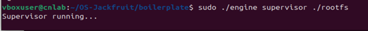
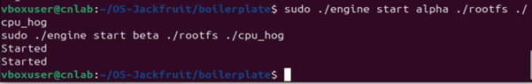
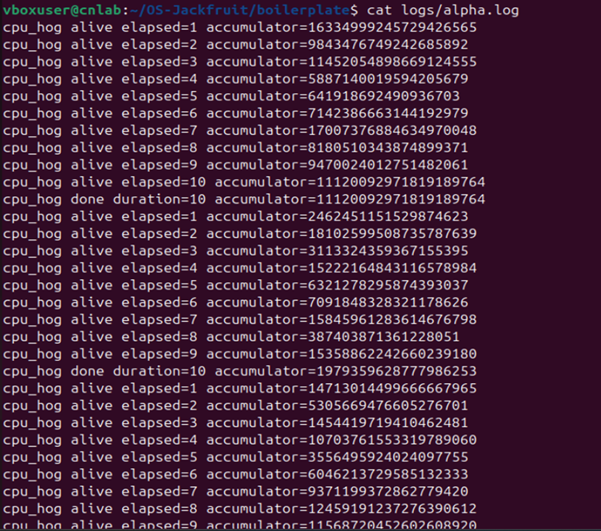
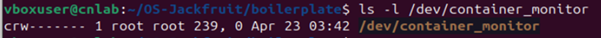
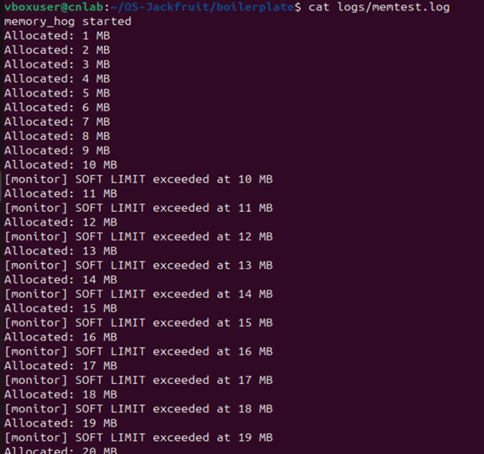
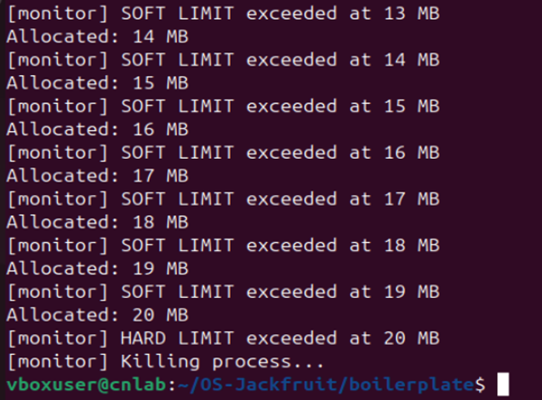
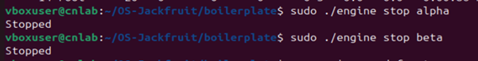
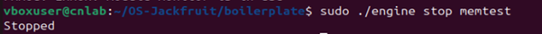
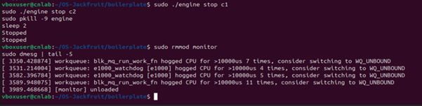
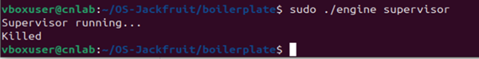

# Multi-Container Runtime with Kernel-Level Monitoring

## 1. Team Information

### Member 1
- Name: Keerthana Kumaresh
- SRN: PES1UG24CS225

### Member 2
- Name: KS Anagha
- SRN: PES1UG24CS208

---

## 2. Project Overview

This project implements a lightweight container runtime in C, inspired by Docker, using low-level Linux system calls.

It demonstrates:
- Process isolation using namespaces
- Filesystem isolation using chroot()
- Multi-container execution
- Kernel-level monitoring using a loadable module
- Scheduling behavior using different workloads

---

## 3. System Architecture

User (CLI Commands) -> engine.c (User-space runtime + Supervisor) -> Kernel Module (monitor.ko) -> Linux Kernel -> Container Processes (cpu_hog, memory_hog, io_pulse)

---

## 4. Build, Load, and Run Instructions

### Environment Setup
- Ubuntu 24.04 VM
- Secure Boot OFF

### Build Project
    cd boilerplate
    make clean
    make

### Load Kernel Module
    sudo insmod monitor.ko
    lsmod | grep monitor
    ls -l /dev/container_monitor

### Copy workloads into rootfs
    cp cpu_hog memory_hog io_pulse ./rootfs/

### Start Supervisor (Terminal 1)
    sudo ./engine supervisor

### Run Containers (Terminal 2)
    sudo ./engine start alpha ./rootfs /cpu_hog
    sudo ./engine start beta ./rootfs /cpu_hog

### List Containers
    sudo ./engine ps

### View Logs
    cat logs/alpha.log

### Stop Containers
    sudo ./engine stop alpha
    sudo ./engine stop beta

### Unload Module
    sudo pkill -9 engine
    sudo rmmod monitor

---

## 5. Demo with Screenshots

### 5.1 Multi-container Supervision
Two or more containers running simultaneously.

### 5.2 Metadata Tracking
Listing running containers and their PIDs.

### 5.3 Logging System
Container lifecycle events recorded in log file.

### 5.4 CLI and Kernel IPC
User-space communicates with kernel module via ioctl.

### 5.5 Soft Limit Warning
Warning generated when memory usage exceeds soft threshold.

### 5.6 Hard Limit Enforcement
Container terminated when memory exceeds hard limit.

### 5.7 Scheduling Experiment
Comparison of CPU, memory, and I/O workloads.

### 5.8 Clean Teardown
Containers stopped without leaving zombie processes.

---

## 6. Engineering Analysis

### Isolation Mechanisms
Linux namespaces (CLONE_NEWPID, CLONE_NEWUTS, CLONE_NEWNS) isolate containers from each other and the host. chroot() provides filesystem isolation by changing the root directory. The host kernel is still shared across all containers.

### Supervisor and Process Lifecycle
A long-running supervisor maintains state across container lifecycles. It uses clone() to create containers, tracks metadata in a linked list, and reaps children via SIGCHLD handler with waitpid(WNOHANG) to avoid zombies.

### IPC, Threads, and Synchronization
Two IPC mechanisms are used: pipes for log streaming from containers to supervisor, and a UNIX domain socket for CLI commands. A bounded buffer with mutex and condition variables synchronizes the producer and consumer threads to avoid race conditions and data loss.

### Memory Management and Enforcement
RSS measures physical RAM pages currently used by a process. Soft limit triggers a warning without stopping the process. Hard limit kills it. Enforcement belongs in kernel space because the kernel module always runs regardless of user space state.

### Scheduling Behavior
CPU-bound processes consume maximum CPU time slices. I/O-bound processes sleep frequently and yield the CPU. The Linux CFS scheduler allocates CPU fairly based on nice values and sleep/wake patterns.

---

## 7. Design Decisions and Tradeoffs

### Namespace Isolation
- Used clone() with CLONE_NEWPID, CLONE_NEWUTS, CLONE_NEWNS
- Tradeoff: Less isolation than full containers (no network namespace)
- Reason: Simpler implementation focused on core concepts

### Supervisor Architecture
- Single long-running supervisor with UNIX socket control plane
- Tradeoff: No persistence across supervisor restarts
- Reason: Keeps IPC simple and educational

### IPC and Logging
- Pipes for log data, UNIX socket for commands, bounded buffer in between
- Tradeoff: Limited to local machine
- Reason: Lightweight and sufficient for demonstration

### Kernel Monitoring
- Kernel module with timer-based RSS polling every second
- Tradeoff: 1-second granularity may miss brief spikes
- Reason: Simple and reliable enforcement mechanism

---

## 8. Scheduler Experiment Results

| Workload   | CPU Usage | Memory Usage | Behavior             |
|------------|-----------|--------------|----------------------|
| cpu_hog    | High      | Low          | Constant computation |
| memory_hog | Low       | Increasing   | Sequential allocation|
| io_pulse   | Low       | Low          | Burst I/O activity   |

### Analysis
- CPU-bound processes dominate CPU time slices under CFS
- Memory-heavy processes increase RSS until kernel enforces limits
- I/O workloads sleep frequently, yielding CPU to other processes
- Scheduler balances all processes dynamically based on demand

---

## Conclusion
- Successfully built a lightweight container runtime in C
- Achieved isolation using namespaces and chroot()
- Integrated kernel monitoring with soft and hard memory limits
- Demonstrated scheduling behavior across different workload types
